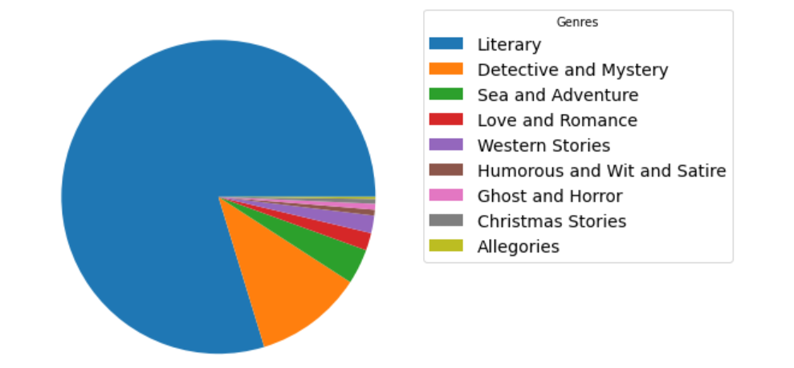
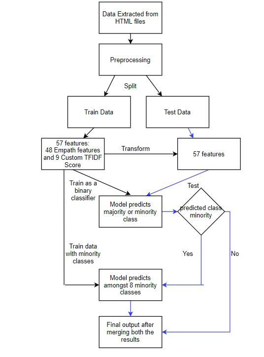

# Genre-Classification-of-Project-Gutenberg
Classify around 1000 books in 9 Genres. The data label distribution of the books is as shown in the diagram below:
  

  
To address the issue of imbalanced data, 2 models are used for classification:
- First Model : To classify id book is literary or not.
- Second model : If not literary than which of the less frequent classes.

The architecture of the model is shown below:

